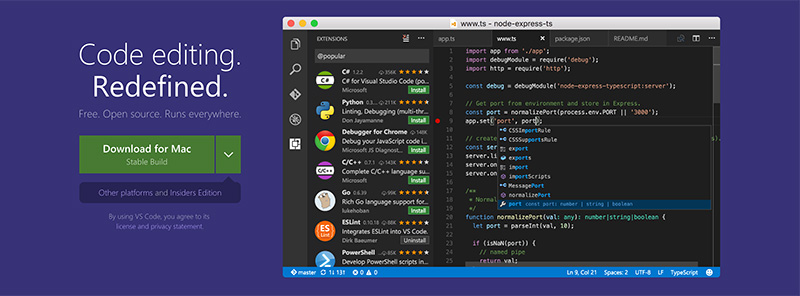
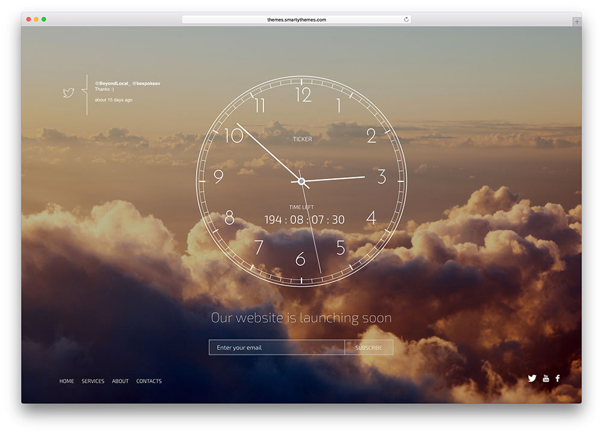

###### DAY01

### 웹 디자인/개발 환경 구성

### 1. [GitHub](http://github.com/) 서비스 가입 및 계정 생성

깃헙(GitHub) 서비스에 가입하여 계정을 생성합니다.

 

-

#### 2. [Visual Studio Code](https://code.visualstudio.com/) 오픈 소스 에디터(Open Source Editor)

-

### 3. [GitHub Page](https://pages.github.com/) 서비스 설정

GitHub 페이지(Page) 저장소 추가/파일생성/커밋/싱크

1. `{사용자_계정이름}.github.io` 저장소 생성
1. [`GitHub Desktop`](https://desktop.github.com/) GUI 도구 설치
1. 원격 저장소(Remote Repository) 복제(Clone Online GitHub Repository)
1. `README.md` 마크다운 문서 생성/수정
1. 로컬 저장소(Local Repository)에 변경사항 커밋(Commit)
1. 원격 저장소에 커밋 데이터 동기화(Sync)

##### README.md 파일 추가

`README.md` 파일은 GitHub 저장소를 소개하는 내용을 출력하는 [Markdown](https://daringfireball.net/projects/markdown/) 문서를 말합니다.

##### 변경(수정) 사항 Commit > Push(Sync)

변경 사항이 발생할 때 마다, 내용을 요약(Summary) 정리하여 `commit` 메시지 추가.

`commit` 완료 후, `sync`하여 로컬 파일을 온라인 GitHub 원격 저장소에 업데이트.

---

### 디자인

__Comming Soon__ Page Design [ PSD | Sketch ]

