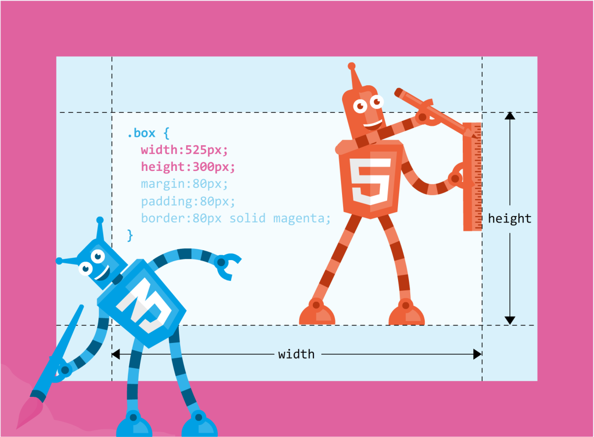
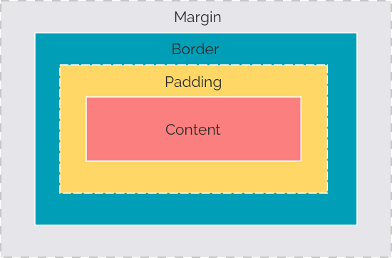
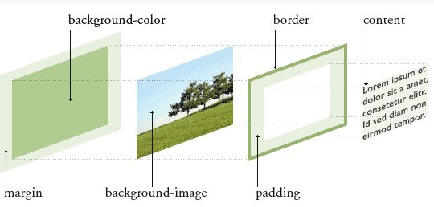
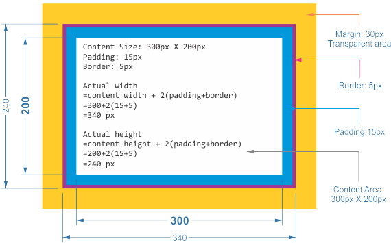

###### DAY03

## 진행 내용

- CSS 박스모델
- 타이포그래피 __본문__, __제목__
- 모듈러(타입) 스케일
- 베이스라인
- 버티컬 리듬
- 재사용 가능한 행간 클래스 속성

---

### CSS 박스모델(Box Model)

HTML 문서의 모든 요소는 박스로 구성되어 있다.





CSS 박스 모델을 입체적으로 그려보면 다음과 같다.



CSS는 박스모델을 사용하여 HTML 문서의 요소를 스타일링한다.



#### CSS 박스 스타일링

```css
/* content-box ------------ */
p {
  width: 450px;
  height: 550px;
}
/* padding-box ------------ */
p {
  padding-top: 0;
  padding-right: 0;
  padding-bottom: 0;
  padding-left: 0;
  /* 속기형 작성법 */
  padding: 0;
}
/* border-box ------------ */
p {
  border-top-width: 1px;
  border-top-style: solid;
  border-top-color: #2590a7;
  /* 속기형 작성법 */
  border-top: 1px solid #2590a7;
}
/* margin-box ------------ */
p {
  margin-top: 0;
  margin-right: 0;
  margin-bottom: 0;
  margin-left: 0;
  /* 속기형 작성법 */
  margin: 0;
}
```

#### 참고하여 읽어볼 글

- [CSS 박스모델](http://crypt.codemancers.com/posts/2013-11-17-box-model-behaviour/)
- [CSS box-sizing](http://magnusbenoni.com/css-box-model-and-box-sizing-explained/)
- [아웃사이드 더 그리드](http://alistapart.com/article/outsidethegrid)
