###### DAY08

## 진행 내용

### 레이아웃 디자인

#### 박스 모델(Box Model)

- content-box
- padding-box
- border-box
- margin-box

-

#### 화면 표시(View)

- display
- visibility
- overflow

-

#### 플로팅(Floating)

- float
- clear

-

#### 포지셔닝(Positioning)

- position
- top
- left
- bottom
- right
- z-index

---

### 사이트 디자인

감각적인 사이트 제작 TIP<i>!</i> 모던 웹 디자인 트렌드 4

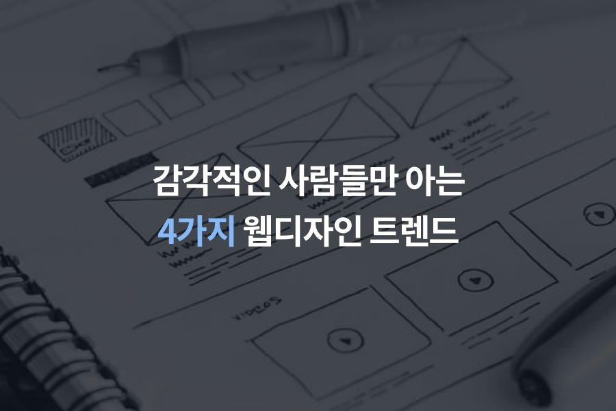

공장에서 찍어낸 듯한 느낌

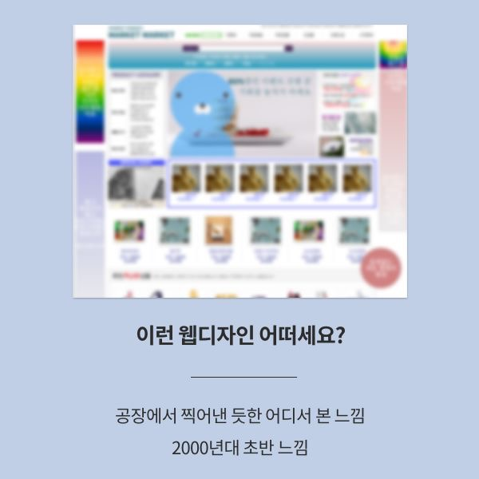

최신 웹 디자인 트렌드는?

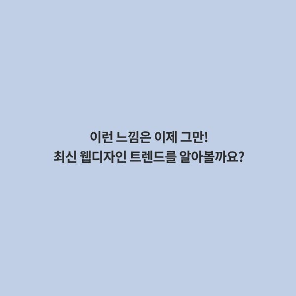

> 1 꽉 찬 이미지 사용

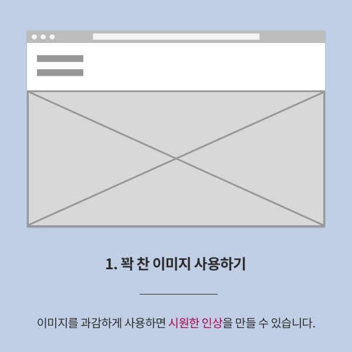

> 2 과도함은 금물<i>!</i>

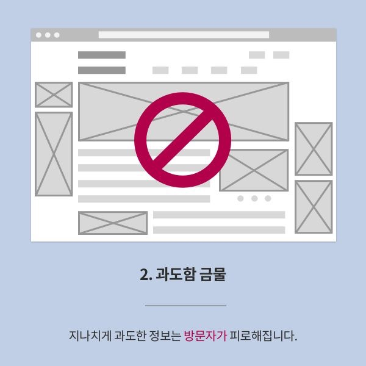

> 3 충분한 여백 활용

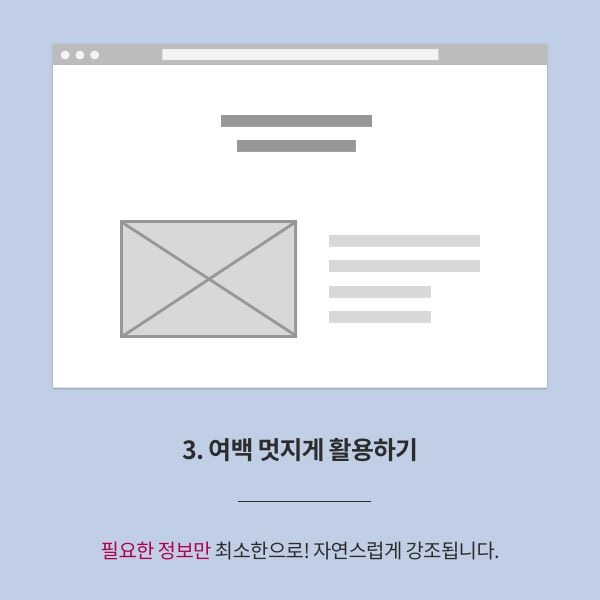

> 4 실용적 타이포그래피

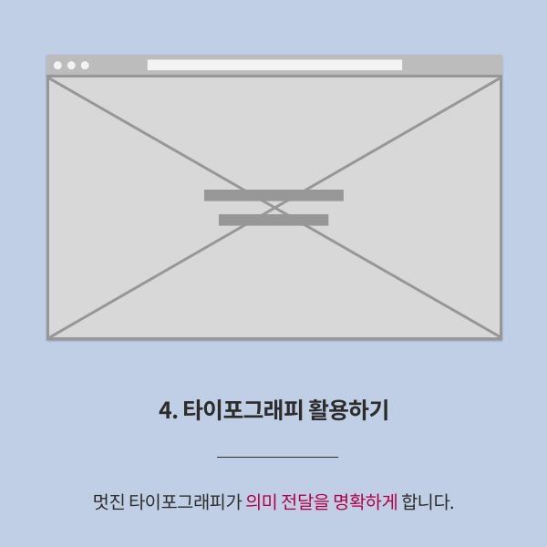

예시 사이트 살펴보기

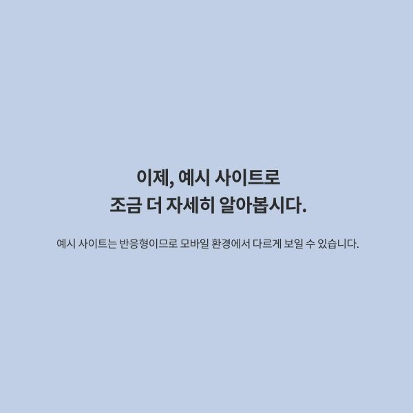

> 1 꽉 찬 이미지 활용

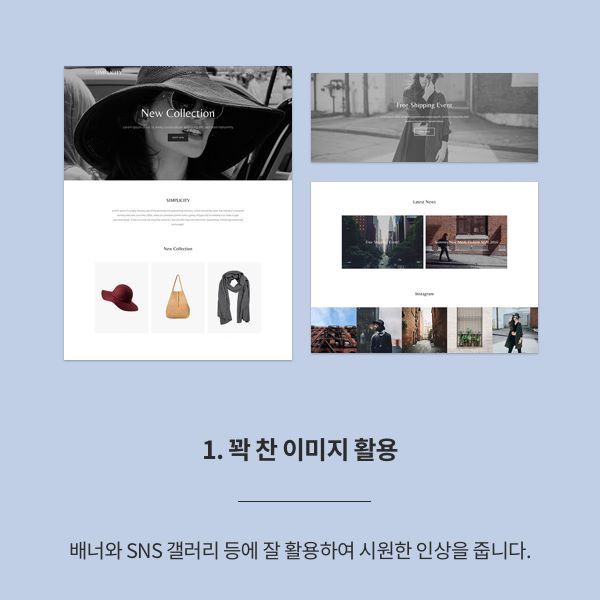

> 2 절제된 이미지

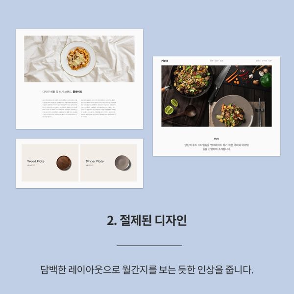

> 3 군더더기 없는 디자인

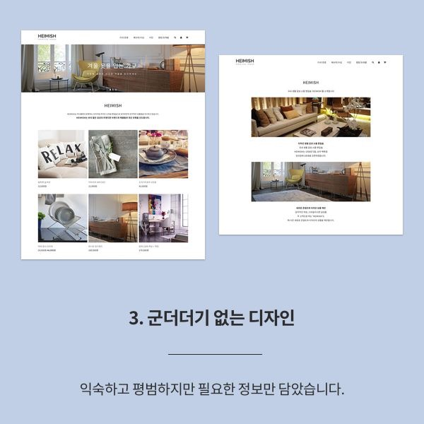

> 4 랜딩 페이지 디자인

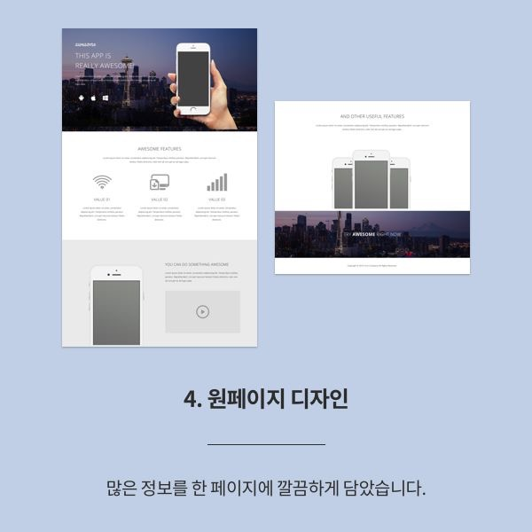
