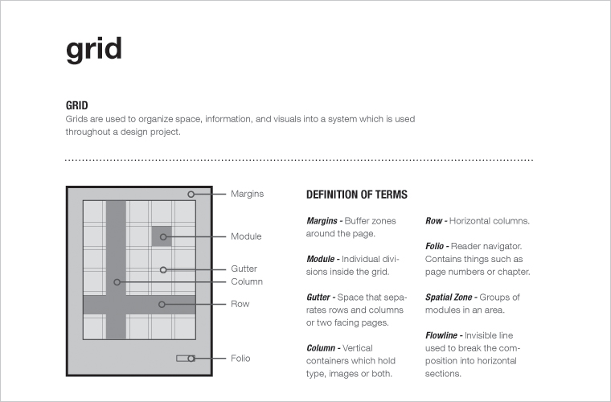
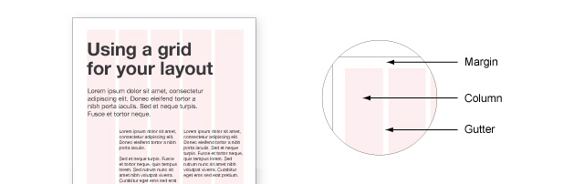
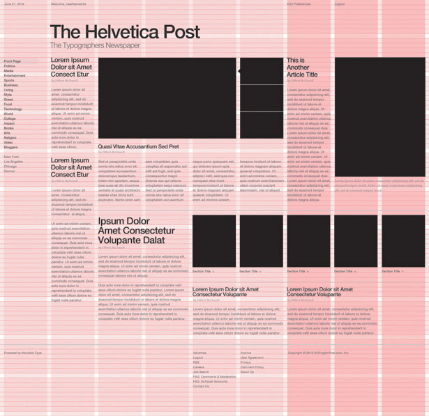
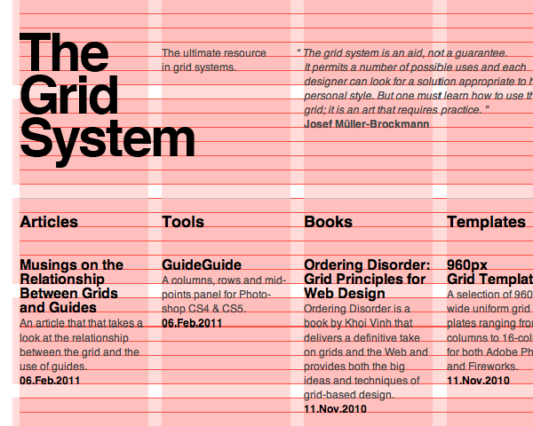

###### Front-End Design CAMP

### 타이포그래피 시스템 (Typography System)

- 목적지 앵커(Anchor)
- 강조(Emphasize, Strong)
- 축약(Abbreviation)
- 인용(Quotation)
- 목록(Lists)
- 표(Tables)

---

### 그리드 시스템 (Grid System)

###### 프린트 기반의 그리드 시스템 (Grid System for Print)

-

###### 웹 기반의 그리드 시스템 (Grid System for Web)

-

###### 그리드 시스템을 활용한 레이아웃

---

##### 참고 자료

- [웹 그리드 시스템](https://github.com/yamoo9/PSD2HTML-CSS/wiki/%EC%9B%B9-%EA%B7%B8%EB%A6%AC%EB%93%9C-%EC%8B%9C%EC%8A%A4%ED%85%9C)
- [instantlogosearch](http://instantlogosearch.com/)
