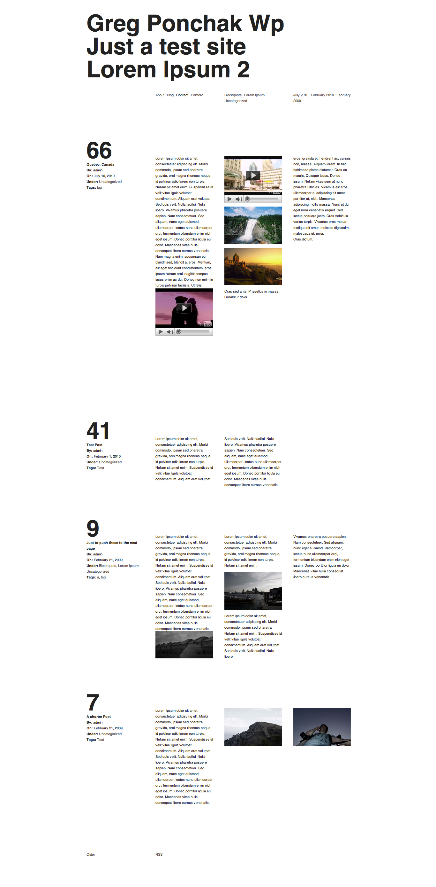
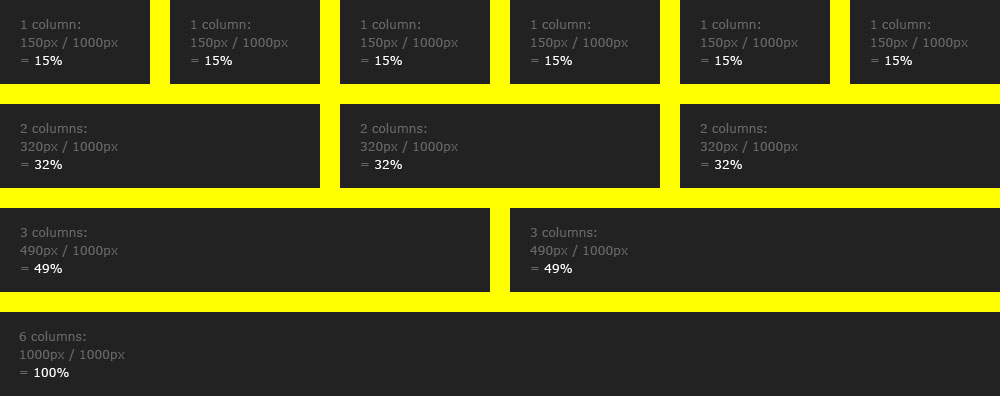

###### Front-End Design CAMP

### Grid System

-

### 이전 과정에서 다룬 내용

- Box-Model
- Box-Sizing
- Display
- Overflow
- Visibility
- Opacity

-

### 수업 진행 내용

##### 플로팅

- Float
    - `left`
    - `right`
    - `none`
- Clear
    - `left`
    - `right`
    - `both`
- Clearfix

##### 포지셔닝
- Position
    - `static`
    - `relative`
    - `absolute`
    - `fixed`

- Direction
    - `left`
    - `top`
    - `right`
    - `bottom`

- Z-Depth
    - `z-index`

-

### 참고자료

- [`Overflow: hidden;` 매직](http://codepen.io/yamoo9/pen/oxowBL)
- [The magic of “overflow: hidden”](http://colinaarts.com/articles/the-magic-of-overflow-hidden/)

<!-- https://www.chenhuijing.com/blog/diamond-grid-using-sass/# -->
<!-- thegridsystem.org -->
